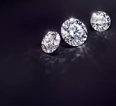

# Project M3
# Diamonds Price Prediction



## Overview

In this project, I've examined the information from over 40,000 diamonds and employed various machine learning techniques to forecast the cost of additional diamonds.


## Repository Structure

The repository is organized as follows:

```data:``` This folder contains the data files used in the dashboard. It includes the test and train diamonds datasets.

```/images:``` Here you will find the images used in the README.

```/notebooks:``` Jupyter files to employed various machine learning techniques to forecast the cost of additional diamonds.

```/results:``` CSV files with the submissions made to kaggle.

```/README.md:``` file explaining the job done.


## Technology stack

In this project it is been used Python, Pandas, Seaborn and Plotly to make an exploratory process of the data and to draw some explanatory plots and different machine learning models in order to achieve the minimum RMSE:

Gradient Boosting Regressor.
Cat Boost.
MLP Regressor.
Random Forest Regressor.
XGB Regressor
Support Vector Regressor

## EDA Results

After conducting the exploratory data analysis in Jupyter Notebook, we have drawn the following key findings:

The carat weight is the most influential factor in determining a diamond's price.

Although Fair is considered the poorest cut quality, it tends to have higher average prices due to its larger carat size.

Diamonds with a Premium cut and colors I and J are among the most expensive, despite being of lower quality. This is primarily attributed to their higher carat weight.

Regarding Clarity, diamonds with grades I1 and SI2 exhibit lower clarity qualities. However, due to the abundance of I and J color diamonds, their prices tend to be higher.

Furthermore, J and I are the color categories associated with larger diamonds.
